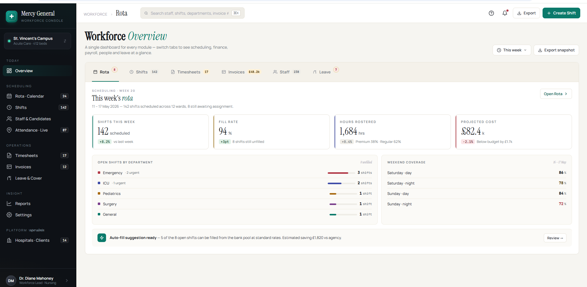
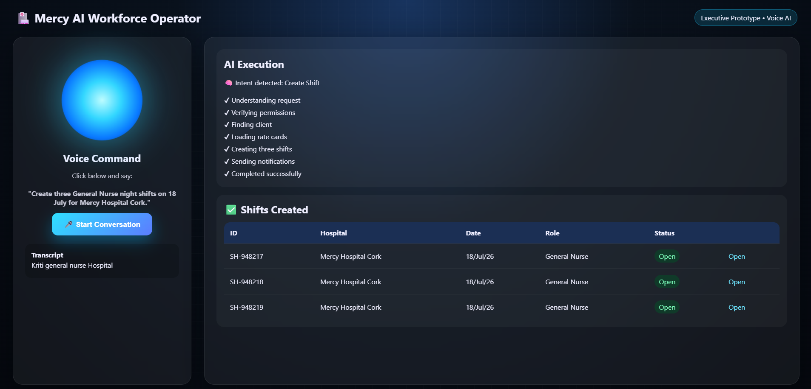

# Workforce Manager

> **Enterprise Workforce Management & Intelligence Platform for Healthcare Staffing, Workforce Planning, Payroll, Finance, and AI-Powered Operations.**

> **Note:** The production implementation of the Mercy AI Workforce Operator is maintained in a private repository. Demonstrations and implementation details are available upon request.


**Platform Modules** · Dashboard · Staff Management · Shift Scheduling · Rota Planning · Attendance · Timesheets · Leave Management · Payroll · Finance · Invoicing · Reporting · AI Workforce Operator

**Business Capabilities** · Workforce Planning · Staff Allocation · Compliance Management · Payroll Processing · Client Billing · Attendance Tracking · Workforce Analytics · AI-Assisted Operations · Operational Intelligence

**Industries** · Hospitals · Healthcare Networks · Care Homes · Home Care Providers · Nursing Agencies · Staffing Agencies · Allied Healthcare · Community Care · Temporary Workforce Providers

---

## Version

**Initial Enterprise SaaS Release**

---

## Overview

**Workforce Manager** is an enterprise SaaS platform built for healthcare organizations, hospitals, care homes, nursing agencies, and staffing providers.

The platform centralizes workforce planning, shift scheduling, rota management, attendance tracking, leave approvals, payroll preparation, invoicing, finance operations, and workforce intelligence into a single modern application.

Designed for enterprise healthcare operations, the platform improves operational efficiency, workforce visibility, compliance, and financial management.



---

# 🤖 Mercy AI Workforce Operator

### Next-Generation Agentic Voice AI

The **Mercy AI Workforce Operator** is an AI-powered voice assistant that enables healthcare organizations to manage workforce operations using natural language.

Users can simply ask the AI to create shifts, allocate staff, approve timesheets, retrieve workforce insights, generate reports, or answer operational questions. The AI understands user intent, plans the required workflow, securely executes actions across multiple modules, and provides real-time confirmations.

### Key Capabilities

- 🎤 Voice-based workforce operations
- 🤖 Agentic AI workflow execution
- 📅 Shift creation and scheduling
- 👥 Intelligent staff allocation
- ✅ Timesheet approvals
- 💰 Payroll assistance
- 📊 Executive dashboards & analytics
- 📄 Report generation
- 🔐 Enterprise security & audit trails


---

# 🚀 Live AI Operator Prototype

Experience the interactive prototype demonstrating the future of AI-driven workforce management.

[](https://vinnybellack.github.io/workforce-manager/docs/Mercy_AI_Executive_Glassmorphism.html)

or run locally

👉 **[Mercy AI Executive Prototype](./Mercy_AI_Executive_Glassmorphism.html)**



---

# Core Modules

## Dashboard

Operational KPIs, workforce utilization, staffing levels, compliance monitoring, and executive insights.

## Staff Directory

Centralized employee management, certifications, compliance, contracts, and workforce profiles.

## Shift Management

Shift creation, scheduling, assignment, and workforce allocation.

## Attendance

Real-time attendance monitoring, exception handling, and audit history.

## Timesheets

Digital approvals, payroll preparation, and complete audit trails.

## Leave Management

Annual leave, sick leave, emergency leave, approvals, and balances.

## Payroll

Payroll preparation using approved timesheets, overtime calculations, and configurable pay rules.

## Finance & Invoicing

Client invoicing, payment tracking, finance approvals, and reconciliation.

## Reporting & Analytics

Operational dashboards, workforce intelligence, finance reports, and executive analytics.

## Administration

Departments, roles, permissions, locations, settings, and platform administration.

---

# Technology Stack

## Frontend

- React
- JavaScript
- React Router
- CSS

## Backend

- Node.js
- Express.js

## Database

- Supabase
- PostgreSQL

## AI Layer

- Google Gemini
- Agentic AI Workflows
- Voice AI
- Workflow Automation
- Workforce Intelligence

---

# Current Status

## ✅ Completed

- Dashboard
- Staff Management
- Shift Management
- Attendance
- Timesheets
- Leave Management
- Payroll
- Finance
- Reporting
- Administration

## 🚧 In Progress

- Invoice Automation
- Executive Reporting
- AI Workforce Insights
- Voice AI Integration
- Predictive Workforce Planning

---

# Platform Architecture

```
Staff Directory
       │
       ▼
Shift Scheduling
       │
       ▼
Attendance
       │
       ▼
Timesheets
       │
       ▼
Payroll
       │
       ▼
Finance & Invoicing
       │
       ▼
Analytics & Reporting
       │
       ▼
Mercy AI Workforce Operator
```

---

# Business Benefits

- Reduce manual workforce administration
- Improve staff utilization
- Streamline payroll preparation
- Accelerate invoice generation
- Improve workforce visibility
- Ensure regulatory compliance
- Enable AI-assisted operational decision making
- Support enterprise-scale healthcare workforce operations

---

# Repository Availability

This repository showcases the architecture, user interface, workflows, and capabilities of the **Workforce Manager** platform.

The complete production implementation—including backend services, database schema, APIs, AI workflows, deployment configuration, and supporting documentation—is maintained in a private repository.

**Project implementation, technical documentation, and demonstration materials are available upon request for recruiters, hiring managers, academic reviewers, and potential collaborators.**

---

# License

**Private Proprietary Software**

Copyright © 2026. All Rights Reserved.

This repository is provided for portfolio and demonstration purposes only. Redistribution, modification, or commercial use is prohibited without prior written permission.
